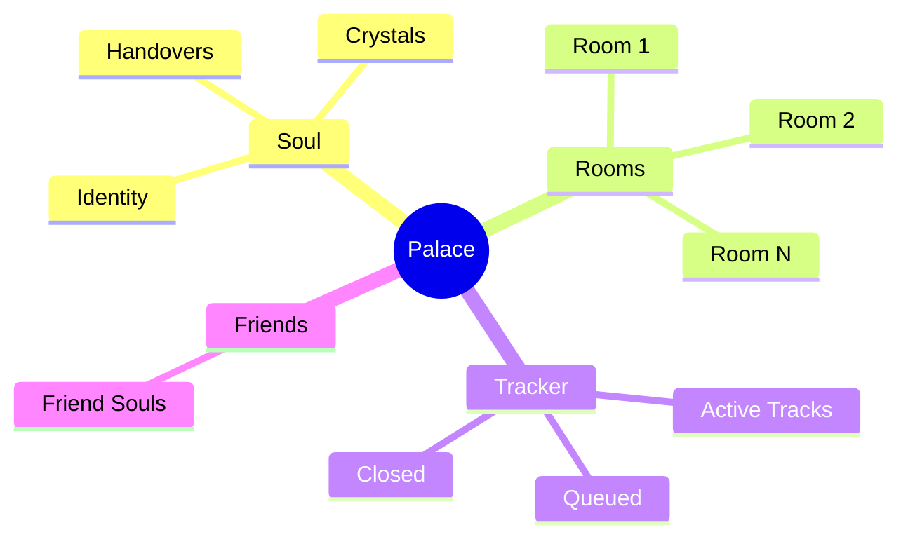

# Palace Mindmap — Self-Starter

> **For Obsidian users.** This creates an initial mindmap of your palace structure during onboarding.

---

## Auto-generated during setup

When the agent completes onboarding, it creates this mindmap in your palace vault:

```
palace-map.canvas
```

### Structure



---

## Canvas Template (JSON)

The agent writes this to `palace-map.canvas`:

```json
{
  "nodes": [
    {"id": "soul", "type": "file", "file": "soul/SOUL.md", "x": 0, "y": 0, "width": 250, "height": 100},
    {"id": "rooms", "type": "text", "text": "# Rooms", "x": -300, "y": 150, "width": 200, "height": 80},
    {"id": "tracker", "type": "file", "file": "tracker.json", "x": 300, "y": 150, "width": 200, "height": 80},
    {"id": "friends", "type": "text", "text": "# Friends", "x": 0, "y": 300, "width": 200, "height": 80}
  ],
  "edges": [
    {"id": "e1", "fromNode": "soul", "toNode": "rooms"},
    {"id": "e2", "fromNode": "soul", "toNode": "tracker"},
    {"id": "e3", "fromNode": "soul", "toNode": "friends"}
  ]
}
```

---

## Agent Instructions

During **Step 3** of onboarding (after interview, while writing files):

1. Check if user wants Obsidian integration: *"Do you use Obsidian? I can set up a visual mindmap of your palace."*
2. If yes, create `palace-map.canvas` in the root of their palace folder
3. Add nodes for each room created
4. Link soul file as the central node
5. Add placeholder for friends (for future soul-sharing)

---

## Linking New Rooms

When a new room is added later, the agent should:

```
Add node: {"id": "[room-id]", "type": "file", "file": "rooms/[room-name]/CLAUDE.md"}
Add edge: {"fromNode": "rooms", "toNode": "[room-id]"}
```

---

## Linking Friends

When a friend soul is added (via `add-friend` process):

```
Add node: {"id": "friend-[name]", "type": "file", "file": "friends/[friend-name]-soul.md"}
Add edge: {"fromNode": "friends", "toNode": "friend-[name]"}
```

---

*Obsidian mindmap integration — palace-starter*
